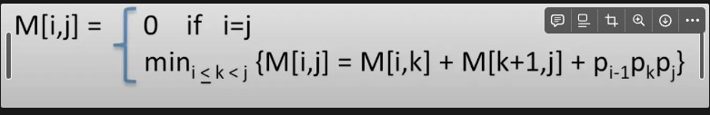

# Welcome to Chain Matrix Multiplication

- This project was inspired by the math formula: Matrix Chain Multiplication 
- The formula takes any sequence of matrixes and returns the most optimal solution via dynamic programming
- This is only achievable when the relationship between the matrices is assoicative

### Resources
- [Youtube] https://www.youtube.com/watch?v=prx1psByp7U&t=1235s
- [Youtube1] https://www.youtube.com/watch?v=GMzVeWpyTN0&t=1629s

## How it works
- The heart of this project is this formula 

This formula utilizes a 2D map, 'M' where its a square matrix of matrix sequence length. 

| Matrix (i by j)   |  1    |  2    |  3    |  4    |
|-------------|-------------|-------------|-------------|-------------|
| 1 | _  | _ | _ | _ |
| 2 | _ | _ | _ | _ |
| 3 | _ | _ | _ | _ |
| 4 | _ | _ | _ | _ |

The goal is to fill up this table which represents the ideal subsequences to perform in order to achieve the optimal performance

The naive solution would be to go through every single position, however based on the parameters this only works with i <= j which means we can automatically cross out half of the table. This may seem inefficent in memory usage especially as matrix sequences get larger however for easy implementation of this formula, a table is needed. Also, the downward diagonal of the table can automatically be set to zero based on the formulas parameters. 

Newly updated table

| Matrix (i by j)   |  1    |  2    |  3    |  4    |
|-------------|-------------|-------------|-------------|-------------|
| 1 | 0  | _ | _ | _ |
| 2 | \ | 0 | _ | _ |
| 3 | \ | \ | 0 | _ |
| 4 | \ | \ | \ | 0 |

Even with the new changes, the naive method would be to compute every single elemential postion which would be done in linear time. However, if we were to use the M table itself, we can reduce the number of operations we need to perform as we are utilizing the M table to store previously computed values. We also start this formula by finding M[1,lenght of sequence]. This is called dynamic programming. 

## Phase 1: Generating Sequence Chart
- Before going into the implementation, we need to understand one key part of the formula. 

Looking back at the formula there are 3 p values at the end of the formula, that we need to find the optimal value 

These values represent the dimenions within the sequence matrices. 

For example:

## Phase 2: Extracting Sequence Order from Sequence Chart
- First we will compute the extraction by hand to understand the formula before going into the implementation

Lets say, we computed all the values for the Sequence table and this is what we got

| Matrix (i by j)   |  1(A)    |  2(B)    |  3(C)    |  4(D)    |
|-------------|-------------|-------------|-------------|-------------|
| 1(A) | 0  | 1 | 2 | 3 |
| 2(B) | \ | 0 | 2 | 3 |
| 3(C) | \ | \ | 0 | 3 |
| 4(D) | \ | \ | \ | 0 |

To begin this process, we start with the whole sequence ABCD. M[A,D] returns 3 which says the subsequence is from A to C.

- 1st iteration: (ABC)D

Now there are two subsequences that we need to repeat the process on: ABC & D

We check what the subsequences are for ABC, and we find this by checking M[A,C], which returns 2. This says the subsequences within ABC is: (AB)C

Next we check sequence D, however since this is a single matrix, there is no need to search. 

- 2nd iteration: ((AB)C)D

- Lastly the subsequence we need to check is AB, however since this is a pair sequence we dont need to repeat this processs. 

-3rd iteration: ((AB)C)D

Now that we are done, the optimal solution to perform is:
- ((AB)C)D

## Phase 2: Matrix Sequence Implementation 
- Looking back at the process, for every subsequence we created from the slice based on the Sequence table, we had to perform a search. This characteristic sounds like a binary tree. 

Every node represents a sequence and each children nodes represents the left and right slice of the optimal subsequence. 

The end result, will have each leaf node represent either a pair matrices or a  singular matrix where we begin the actual computation of the sequence. 

## Phase 3: Computing Matrix Sequence 

- Computing the matrix sequence is standard matrix mulitplication 

## Phase 4: Improving Matrix Sequence Computation 

- Computing matrix sequence sequence with GPUs
- Parallel computation with GPUs on larger sequences
